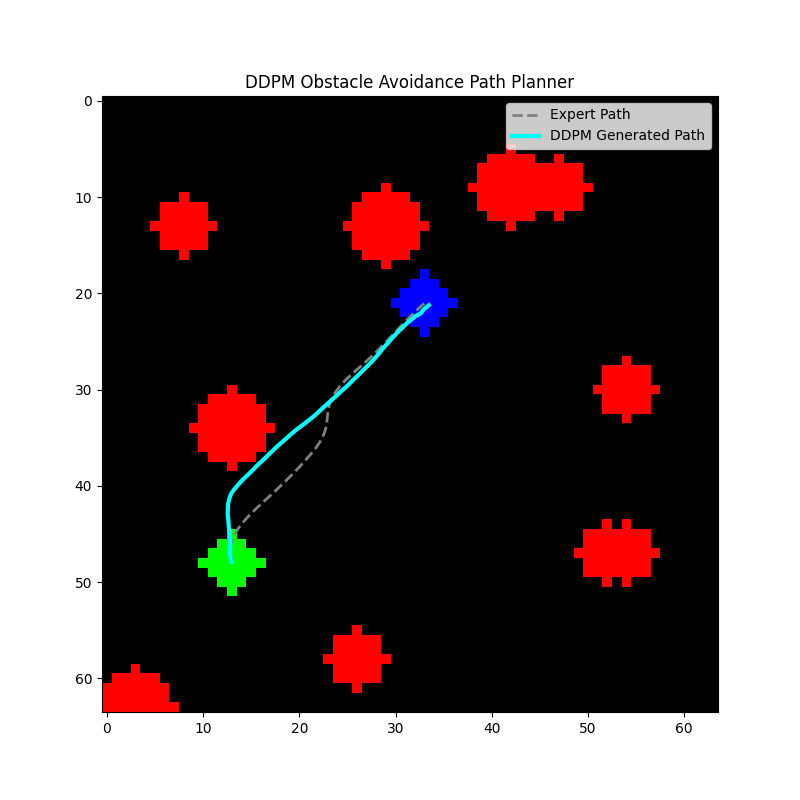
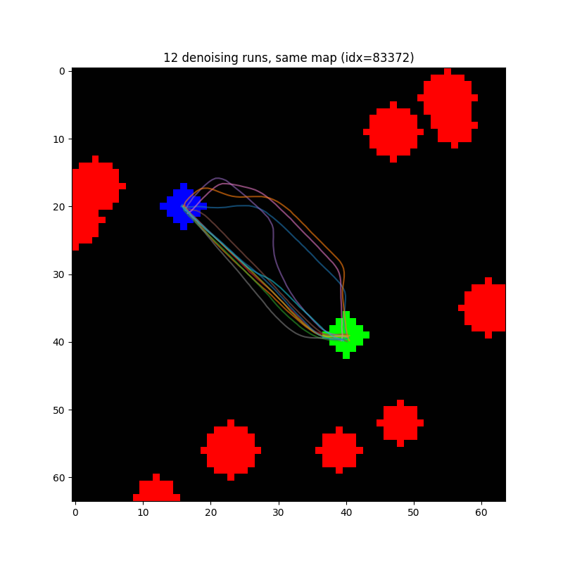
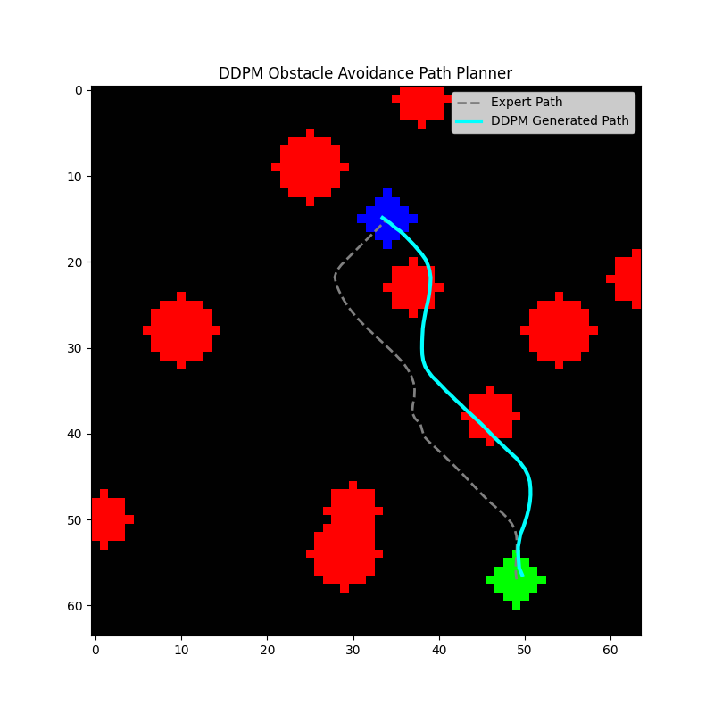
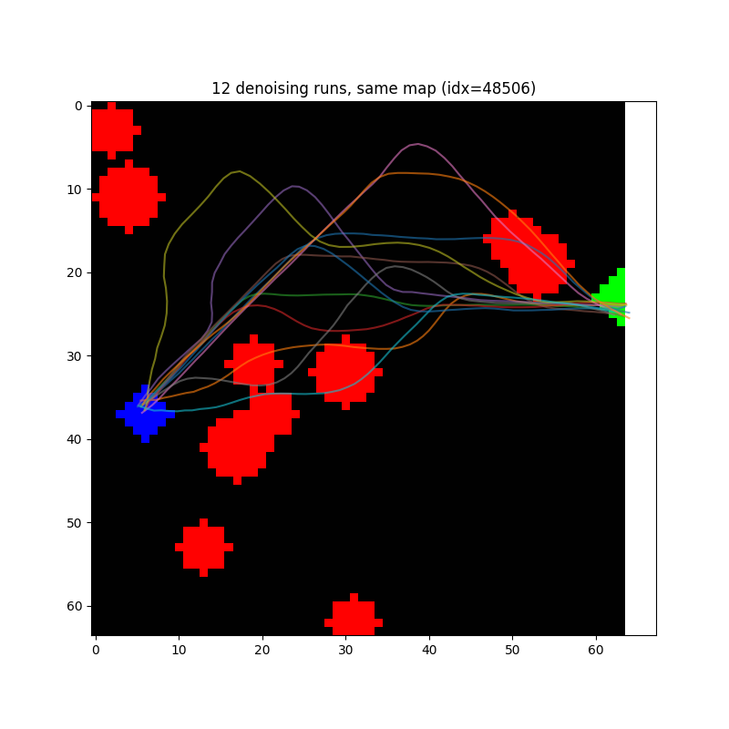

# Diffusion Path Planner

A denoising diffusion (DDPM) model that generates 2D obstacle avoidance paths, conditioned on a map of obstacles, start, and goal (2D with 3 Channels). Built to learn how diffusion models work in a robotics and path planning context. Inspired by [Rin-Li/diffusion_motion](https://github.com/Rin-Li/diffusion_motion).

## Overview

Given a 64x64 grid containing obstacles, a start point, and a goal point, the model generates a 64-point path connecting start to goal while avoiding the obstacles. The setup is a standard diffusion policy: a CNN encodes the map into a single embedding vector, and a 1D conditional U-Net denoises a randomly sampled noise into a path, conditioned on the map embedding and the diffusion timestep through FiLM.

The short version of the result: the model produces smooth, paths that follow the general geometry of a map. BUT IT DOES NOT RELIABLY AVOID OBSTACLES. The "Results and observations" section below goes through what I found and why, since that ended up being the more interesting part of the project.

## Method

### Dataset generation

- Maps are 64x64 grids with a configurable number of randomly placed circular obstacles.
- Obstacles are inflated by a safety margin (binary dilation) before a start and a goal point are sampled from the remaining free space.
- An expert path between start and goal is found with BFS algorithm on the inflated obstacle map, then fit with a smoothing spline and resampled to a fixed number of points.
- Start and goal points are dilated into small blobs so they are visible after the CNN's downsampling.
- Implemented in `functions.py` (`generate_single_sample`, `find_path_bfs`, `smooth_path`), generated by `sample_creation.py`.

### Model

- `MapEncoder`: a 3-layer CNN over the 3-channel map (obstacles, start, goal), flattened and projected to a single embedding vector.
- `CustomConditionalUNet`: a 1D U-Net operating on the trajectory as a (2, num_points) sequence, x and y per point. Each block is conditioned on the diffusion timestep (added directly) and the map embedding (through FiLM which is a learned channel scale and shift).
- `DiffusionPlanner` connects both into a single model matching the standard `diffusers` noise prediction format.

### Training

- Standard DDPM setup using `diffusers.DDPMScheduler`: sample a timestep and noise, add noise to the clean (normalized) path, train the U-Net to predict that noise, MSE loss.
- Train/val/test split, checkpoint on best validation loss.

## Results and observations

Training converges, and the model learns the task at a coarse level. The generated paths run from the right start to the right goal, in quasi the right shape, and mostly avoid obstacles.




A clean result (the generated path (cyan) tracks the expert path (gray) closely and avoids obstacle) (although not infront)




Not every run looks like that. Here the generated path cuts inside the obstacle through the route.

### What was tried

- Increasing the obstacle safety margin at dataset-generation time.
- Dilating start/goal points into larger blobs so they survive CNN downsampling.
- Classifier-free guidance, during training and sampling.
- Test-time guidance: computing an obstacle penalty gradient during denoising and using it to push the trajepathctory away from obstacles. This made outputs unstable rather than better, likely because a raw gradient step at an arbitrary scale relative to what the model expects at a given noise level.

None of these resolved it on their own.

### Known limitations

- The model does not guarantee obstacle avoidance. Depending on the map, anywhere from zero to all sampled trajectories can intersect an obstacle.
- Sampling is stochastic — running the same map multiple times can give a different path each time (see `nn_multi_seed_test.py`).

## Repository structure

```
functions.py: dataset generation, BFS path search, spline smoothing, PyTorch Dataset class
nn_models.py: CNN map encoder, FiLM-conditioned 1D U-Net, DiffusionPlanner wrapper
parameters.py: all configuration in one place (grid size, obstacle params, training hyperparameters)
sample_creation.py: generates and saves the dataset (map_path_dataset.npz)
sample_visualization.py: visualizes a few raw dataset samples (map + expert path)
nn_train.py: trains the model, saves best_diffusion_path_planner_weights.pth
nn_test.py: runs the trained model on a single held-out sample and plots the result
nn_multi_seed_test.py: runs the trained model on one map with several noise seeds, to check consistency
generated_paths/: output plots from test runs
```

## Setup

```bash
git clone https://github.com/Ahmad-Rahmani-MCT/diffusion-path-planner.git
cd diffusion-path-planner
python -m venv .venv
source .venv/bin/activate
pip install -r requirements.txt
```

## Usage

All parameters (grid size, obstacle count, training hyperparameters, file names) live in `parameters.py`.

1. Generate a dataset:
   ```bash
   python sample_creation.py
   ```
   Saves `map_path_dataset.npz`.

2. Check a few raw samples before training:
   ```bash
   python sample_visualization.py
   ```

3. Train:
   ```bash
   python nn_train.py
   ```
   Saves the best checkpoint to `best_diffusion_path_planner_weights.pth` based on validation loss.

4. Run inference on a single held-out sample:
   ```bash
   python nn_test.py
   ```

5. Check consistency across noise seeds on the same map:
   ```bash
   python nn_multi_seed_test.py
   ```

## Possible extension (Intersection with control)

- Using the diffusion output as a reference path for a sampling based controller like MPPI, which can enforce obstacle constraints at execution time regardless of what the diffusion model proposes. See my other repository (https://github.com/Ahmad-Rahmani-MCT/2d-pa-mppi)

## References

- Weng, Lilian. (Jul 2021). What are diffusion models? Lil’Log. https://lilianweng.github.io/posts/2021-07-11-diffusion-models/.
- [Rin-Li/diffusion_motion](https://github.com/Rin-Li/diffusion_motion) — inspiration for this project.
- [huggingface/diffusers](https://github.com/huggingface/diffusers) — `DDPMScheduler`, used for training and sampling.